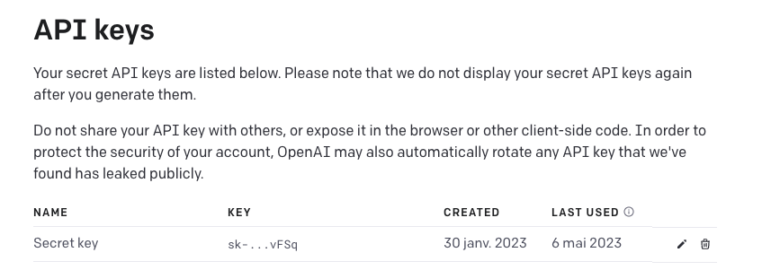

# PDF to Quiz

## Important note

If you are not a software developer and want to try out this tool for free, you can visit https://pdfquiz2.xtierdev.com/

The version deployed is not using OpenAI GPT3.5 but my own fine tuned model version [fbellame/mistral-pdf-to-quizz-7b](https://huggingface.co/fbellame/mistral-pdf-to-quizz-7b)

To make this work I deployed the model on [RunPod.io](https://www.runpod.io/gpu-instance/pricing). 

This is not cheap, it cost .20$/hour. You can help me keep this app online by a small donatation (1$ or 2$) on my [kof-fi page](https://ko-fi.com/fbellame#)

## Usage

Upload a multiple page PDF and generate a quiz with multiple options. For each page 2 questions will be generated.

This leverage Langchain library to abstract the LLM (Large Language Model) calls.

The UI is based on Streamlit

Here is an exemple PDF (sorry in french but you can get the idea...)


Will generate the following interractive quiz questions:


## Pre-requisite

You need an OpenAI API key from https://platform.openai.com/account/api-keys

Keep in mind this is not free BUT the with the usage of **gpt-3.5-turbo** it's not expensive at all unless you drop really big PDF (more than 100 pages).



Once you have your API key you can install it in your terminal like this:

``` sh
export OPENAI_API_KEY=[Your-API-key]
```


## Instructions


To install:
``` sh
pip install -r requirements.txt
```

## Run


To run:
```sh
streamlit run ui.py
```

To run on docker
```sh
docker build -t pdf-to-quizz .
docker run -e OPENAI_API_KEY=[your-api-key] -p 8501:8501 pdf-to-quizz
```
