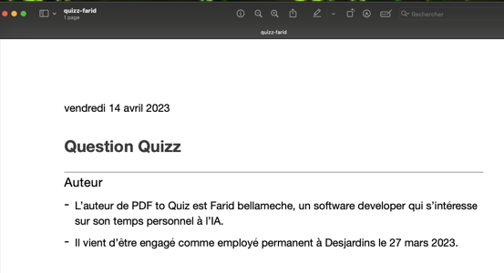
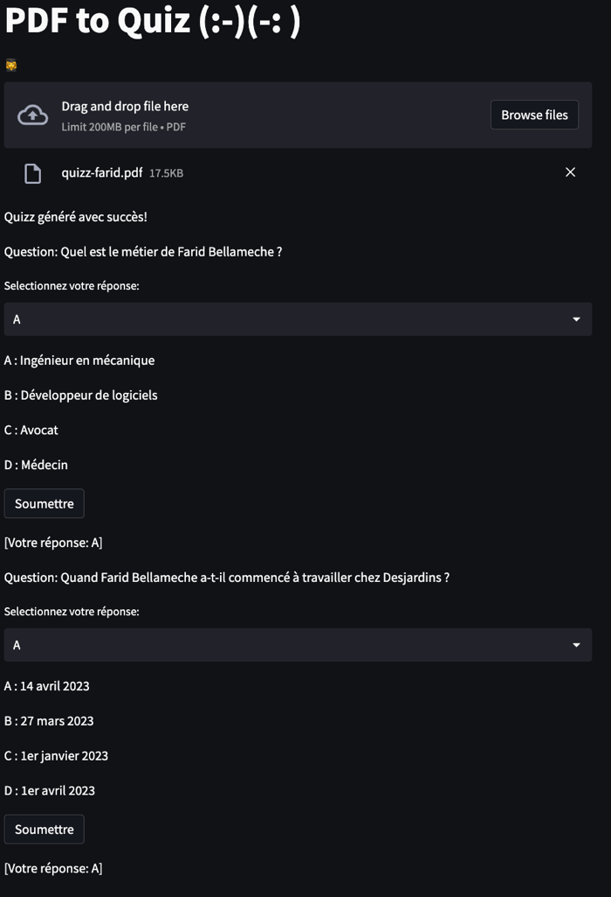

# PDF to Quiz

Upload a multiple page PDF and generate a quiz with multiple options. For each page 2 questions will be generated.

This leverage Langchain library to abstract the LLM (Large Language Model) calls.

The UI is based on Streamlit

Here is an exemple PDF (sorry in french but you can get the idea...)



Will generate the following interractive quiz questions:




## Pre-requisite

You need docker to run TGI.
You can also deploy your model on HuggingFace.


## Instructions


To install:
``` sh
pip install -r requirements.txt
```

## Run

Huggingface TGI will be used to start an inference endpoint.

```sh
 model=fbellame/pdf_to_quizz_llama_13B_8bits
 volume=$PWD/data
 num_shard=1

 sudo docker run --gpus all --shm-size 1g -p 8080:80 -v $volume:/data ghcr.io/huggingface/text-generation-inference:0.9 --model-id $model --num-shard $num_shard
```


To run the UI:
```sh
streamlit run ui.py
```
